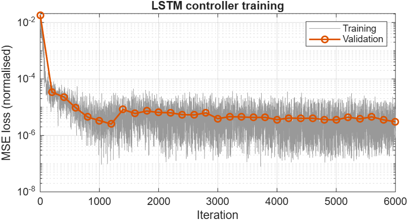
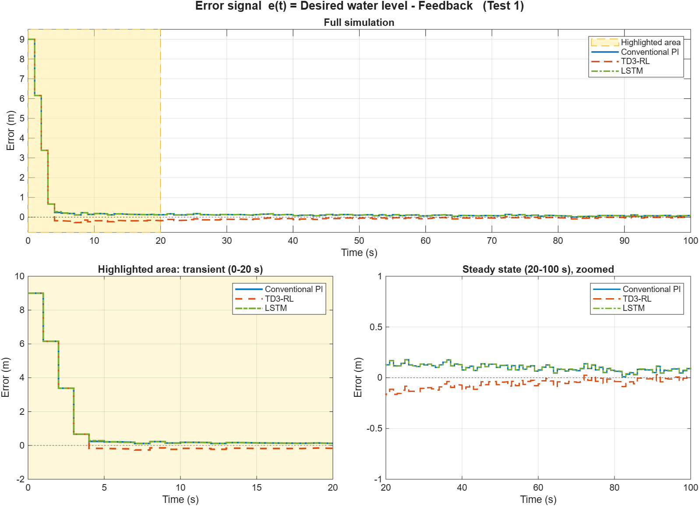
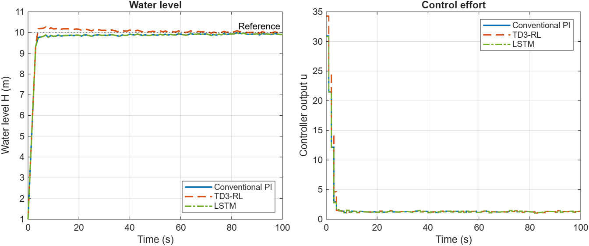
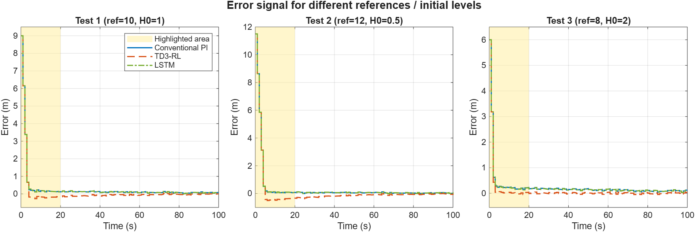

 Water Tank Level Control

**Conventional PI vs TD3 Reinforcement Learning vs LSTM controller**
MATLAB R2026a (Simulink, Reinforcement Learning Toolbox, Deep Learning Toolbox)

---

## 1. Objective

Use the water-tank plant from the MathWorks example *Tune PI Controller Using Reinforcement Learning* (TD3). Replace the PI controller with an LSTM controller that uses the previous 4 memory samples. Compare the error signal **e(t) = Desired water level − Feedback** for the conventional PI, the TD3-RL controller and the LSTM controller, with the transient region highlighted.

## 2. Plant and simulation set-up

- Plant: nonlinear water tank, `dH/dt = (b·u − a·√H) / A`, from the example model `watertankLQG.slx`, with band-limited white process noise (variance 0.01).
- Sample time Ts = 1 s, simulation time Tf = 100 s. Pump input saturation is kept exactly as in the example.
- Main test: reference = 10 m, initial level H0 = 1 m, noise seed = 1 (same scenario as the MathWorks example). Two extra tests check generalisation: (ref 12, H0 0.5) and (ref 8, H0 2).

## 3. Controllers

| Controller | Description |
|---|---|
| Conventional PI | Tuned with Control System Tuner (LQG goal): Kp = 3.4373, Ki = 0.0358 |
| TD3-RL | Pretrained TD3 agent `WaterTankPITuningTD3AgentUseCase1.mat`. The actor is linear (`myBasisFcn`), so its weights are the PI gains: Kp = 3.8090, Ki = 0.1130 |
| LSTM | Replaces the PID Controller block in the same plant model (`watertankLSTM.slx`, MATLAB System block `LSTMController.m`) |

### LSTM controller design

- **Input:** a sequence of the **previous 4 memory samples** (k−3 … k). Each sample holds 2 features: error `e` and integral of error `∫e`. These are the same observations the TD3 agent uses.
- **Network:** `sequenceInput(2) → LSTM(32 hidden units, last output) → FC(16) → tanh → FC(1) → u(k)`
- **Training:** supervised imitation of the PI control law. Data came from 300 closed-loop Simulink episodes with random reference (8–12 m), initial level (0–2 m), noise seed and perturbed gains, so the network sees a wide range of states. That gave 30,300 windows, split 85/15 into training and validation. Settings: Adam, 60 epochs, MSE loss. Final validation MSE was about 3×10⁻⁶ (normalised).
- **Deployment:** the trained network runs inside Simulink at every sample (Ts = 1 s) in closed loop with the nonlinear plant.


*Fig. 1: LSTM training and validation loss*

## 4. Results: error signal comparison


*Fig. 2: Error e(t) = desired level − feedback. Shaded yellow = highlighted area (transient, 0–20 s), shown enlarged bottom-left. Bottom-right zooms in on the steady state.*

**Test 1 (ref 10, H0 1)**

| Controller | IAE | ISE | ITAE | Mean \|e\| 60–100 s | Rise time (s) | Settling time (s) | Overshoot (%) | LQG cost |
|---|---|---|---|---|---|---|---|---|
| Conventional PI | 29.67 | 132.04 | 471.9 | 0.076 | 2.60 | 10.20 | 0 | −155.72 |
| TD3-RL | 26.90 | 131.74 | 265.6 | 0.031 | 2.60 | 17.07 | 2.99 | −155.37 |
| LSTM | 29.81 | 132.07 | 483.2 | 0.080 | 2.60 | 10.08 | 0 | −155.71 |


*Fig. 3: Water level and controller output (Test 1)*


*Fig. 4: Error signal for three reference / initial-level scenarios*

**IAE for all test scenarios**

| Scenario | Conventional PI | TD3-RL | LSTM |
|---|---|---|---|
| Test 1 (ref 10, H0 1) | 29.67 | 26.90 | 29.81 |
| Test 2 (ref 12, H0 0.5) | 35.26 | 46.06 | 35.77 |
| Test 3 (ref 8, H0 2) | 24.06 | 11.75 | 23.87 |

## 5. Discussion

- **Highlighted area (transient):** for the first ~3 s all three controllers drive the pump into saturation, so the error falls identically and the rise time is the same (2.6 s). After that they differ. The PI and LSTM approach the reference from below, leaving a small positive error of about 0.1–0.2 m that the low integral gain removes slowly. The TD3-RL controller has a larger integral gain (Ki = 0.113 vs 0.036), so it overshoots slightly (about 3 %, negative error) and then converges.
- **Steady state:** TD3-RL has the smallest residual error (mean |e| = 0.031 m vs 0.076 m) and the lowest IAE/ITAE in Tests 1 and 3. Its overshoot gives it a longer settling time, and it does worse in Test 2 (ref 12), where the overshoot is larger.
- **LSTM:** working from only the last 4 memory samples, the LSTM controller reproduces the PI behaviour very closely: the RMS difference between the LSTM and PI control signals is 0.026, and IAE is within 1.5 % in all tests, including references it was not specifically trained on. Its LQG cost (−155.71) is essentially the same as the PI (−155.72). Since it learned by imitating the PI, its performance is bounded by the PI it was trained on. Training it on the TD3 agent, or with an RL objective, would be the natural next step.
- **Conclusion:** all three controllers are stable and track the reference. The TD3-tuned controller gives the lowest error in the main test. The LSTM shows that a neural controller with a 4-sample memory can replace the conventional PI controller in the same plant with equivalent closed-loop performance.

## 6. Files and how to run

| File | Purpose |
|---|---|
| `DA2_main.m` | Main script: loads the TD3 agent, generates data, trains the LSTM, runs all simulations, saves figures and tables in `results/` |
| `build_models.m` | Creates `watertankPI_cmp.slx` (PI plus signal loggers) and `watertankLSTM.slx` (PID block replaced by the LSTM block) from `watertankLQG.slx` |
| `LSTMController.m` | MATLAB System object holding the 4-sample memory and running the LSTM (used by the Simulink block) |
| `lstmController.mat` | Trained LSTM network and scaling |
| `watertankLQG.slx` | Original water-tank plant with PI controller |
| `WaterTankPITuningTD3AgentUseCase1.mat` | Pretrained TD3 agent |
| `myBasisFcn.m` | Basis function for the TD3 actor (needed to load the agent) |

**To run:** open MATLAB in this folder and enter:

```matlab
DA2_main
```

